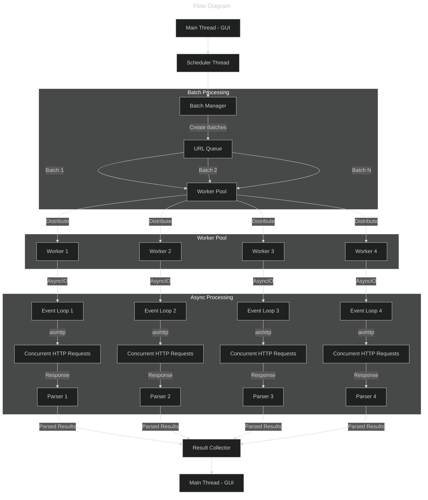
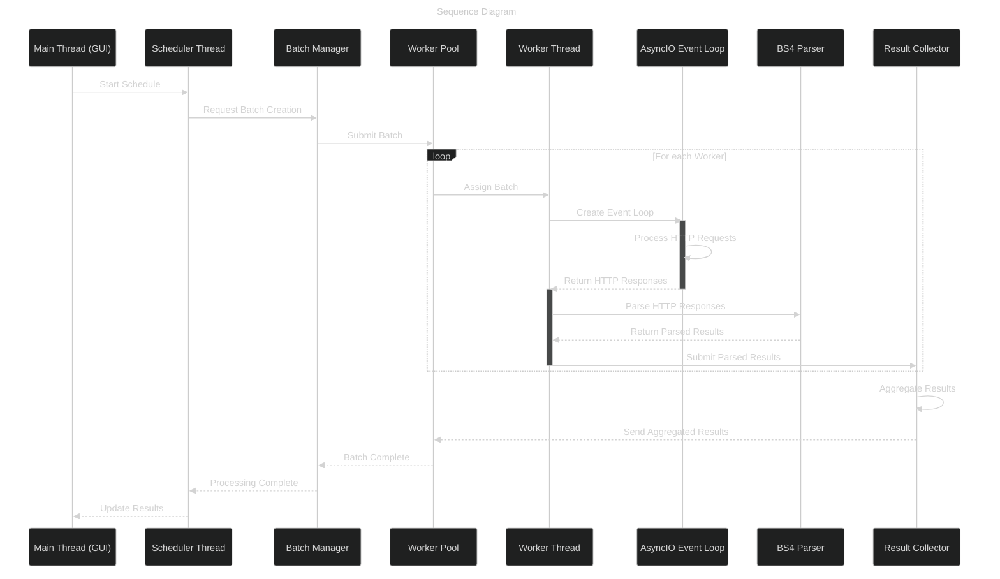

```mermaid
---
config:
  theme: dark
  layout: fixed
title: Flow Diagram
---

graph TD
    A[Main Thread - GUI] --> B[Scheduler Thread]
    B --> C[Batch Manager]
    
    subgraph Batch Processing
        C -->|Create Batches| D[URL Queue]
        D -->|Batch 1| E[Worker Pool]
        D -->|Batch 2| E
        D -->|Batch N| E
    end
    
    subgraph Worker Pool
        E -->|Distribute| F1[Worker 1]
        E -->|Distribute| F2[Worker 2]
        E -->|Distribute| F3[Worker 3]
        E -->|Distribute| F4[Worker 4]
    end
    
    subgraph Async Processing
        F1 -->|AsyncIO| G1[Event Loop 1]
        F2 -->|AsyncIO| G2[Event Loop 2]
        F3 -->|AsyncIO| G3[Event Loop 3]
        F4 -->|AsyncIO| G4[Event Loop 4]
        
        G1 -->|aiohttp| H1[Concurrent HTTP Requests]
        G2 -->|aiohttp| H2[Concurrent HTTP Requests]
        G3 -->|aiohttp| H3[Concurrent HTTP Requests]
        G4 -->|aiohttp| H4[Concurrent HTTP Requests]

        H1 -->|Response| P1[Parser 1]
        H2 -->|Response| P2[Parser 2]
        H3 -->|Response| P3[Parser 3]
        H4 -->|Response| P4[Parser 4]
    end
    
    P1 -->|Parsed Results| I[Result Collector]
    P2 -->|Parsed Results| I
    P3 -->|Parsed Results| I
    P4 -->|Parsed Results| I
    
    I --> Z[Main Thread - GUI]

```

```mermaid
---
config:
  theme: dark
  layout: fixed
title: Sequence Diagram
---

sequenceDiagram
    participant GUI as Main Thread (GUI)
    participant Scheduler as Scheduler Thread
    participant BM as Batch Manager
    participant WP as Worker Pool
    participant Worker as Worker Thread
    participant Async as AsyncIO Event Loop
    participant Parser as BS4 Parser
    participant RC as Result Collector

    GUI->>Scheduler: Start Schedule
    Scheduler->>BM: Request Batch Creation
    BM->>WP: Submit Batch
    
    loop For each Worker
        WP->>Worker: Assign Batch
        Worker->>Async: Create Event Loop
        
        activate Async
        Async->>Async: Process HTTP Requests
        Async-->>Worker: Return HTTP Responses
        deactivate Async
        
        activate Worker
        Worker->>Parser: Parse HTTP Responses
        Parser-->>Worker: Return Parsed Results
        Worker->>RC: Submit Parsed Results
        deactivate Worker
    end
    
    RC->>RC: Aggregate Results
    RC-->>WP: Send Aggregated Results
    WP-->>BM: Batch Complete
    BM-->>Scheduler: Processing Complete
    Scheduler-->>GUI: Update Results

```